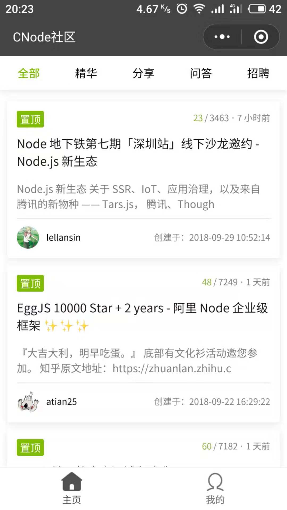
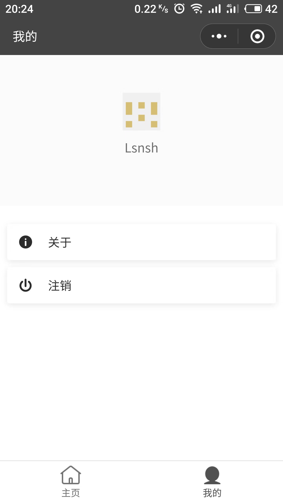
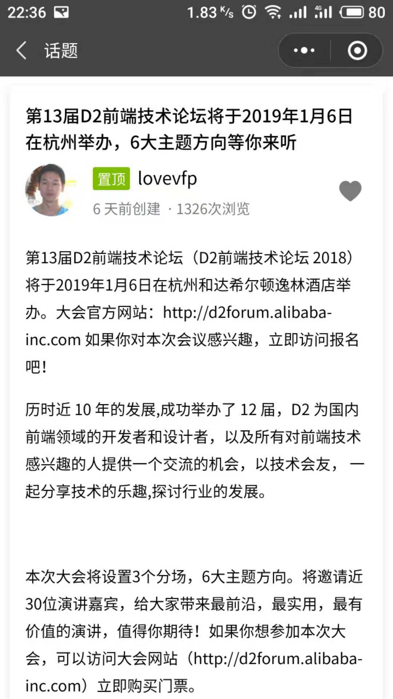
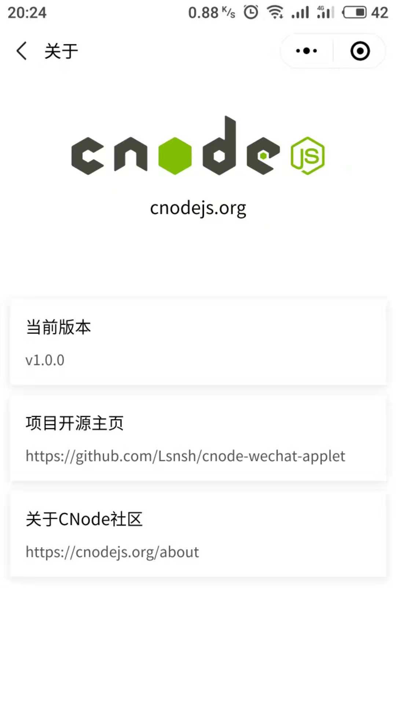

# cnode-wechat-applet

CNode 社区第三方微信小程序版本


## 预览




## 踩到的坑

### 1. npm支持 - 构建npm导致的问题

1. 由于需要格式化一些日期数据，于是选择了`moment`

2. 首先使用命令行，安装`moment`
    ```shell
    # 打开小程序根目录
    cd src
    npm install --production moment
    ```

3. 然后按照小程序文档往下操作，直到**构建完成**

4. 于是我们迫不及待的开始使用`moment`
    ```js
    import moment from 'moment';
    
    let sFromNowText = moment(new Date() - 360000).fromNow();
    console.log(sFromNowText);

    // 控制台输出："6 minutes ago"
    ```

5. `moment`能够正常工作，但是很快我们发现英文不是我们想要的

6. 于是我们找到`moment`的[国际化配置][2]，并`设置全局语言为`中文
    ```js
    import moment from 'moment';
    moment.locale('zh-cn');

    let sFromNowText = moment(new Date() - 360000).fromNow();
    console.log(sFromNowText);

    // 可是控制台，依然输出："6 minutes ago"
    ```

7. 尝试输出`moment.locale`执行后的返回值
    ```js
    // ...
    let sLang = moment.locale('zh-cn');
    console.log(sLang);

    // 控制台输出："en"
    ```

8. 发现设置语言环境失败了，经过排查和翻阅[小程序文档][1]后，发现通过微信开发者工具`构建npm`后，并不会将语言环境相关文件拷贝到`miniprogram_npm`目录下，仅将入口js文件及其依赖的模块进行打包处理，进而导致加载中文语言环境失败。以下是摘自小程序文档的一段话：
    ```
    构建打包分为两种：小程序 npm 包会直接拷贝构建文件生成目录下的所有文件到 miniprogram_npm 中；其他 npm 包则会从入口 js 文件开始走一遍依赖分析和打包过程（类似 webpack）。
    ```

9. 快速查看了一下`moment`源码，发现`moment.locale`方法，会从`./locale/`目录下加载语言环境包，于是尝试手动从`node_modules/moment/`目录下，将中文语言环境包，拷贝到`miniprogram_npm`目录下
    ```js
    // moment.js
    // ...
    function loadLocale(name) {
      // ...
      var aliasedRequire = require;
      aliasedRequire('./locale/' + name);
      // ...
    }
    // ...
    ```

10. 经过调试发现，`moment`定义语言环境时出错，原来是由于`构建npm`导致入口文件(`moment.js`)经过打包后更名为`index.js`导致：`Error: module "miniprogram_npm/moment/moment" is not defined`
    ```js
    // zh-cn.js
    (function(global, factory) {
      typeof exports === 'object' && typeof module !== 'undefined' && typeof require === 'function'
        ? factory(require('../moment'))
        : typeof define === 'function' && define.amd
          ? define(['../moment'], factory)
          : factory(global.moment);
    })(this, function(moment) {
      'use strict';

      var zhCn = moment.defineLocale('zh-cn', {
        // ...
      });

      return zhCn;
    });
    ```

11. 果然手动将`'../moment'`统一改为`'../index'`，然后重新执行
    ```js
    import moment from 'moment';
    moment.locale('zh-cn');

    let sFromNowText = moment(new Date() - 360000).fromNow();
    console.log(sFromNowText);

    // 现在控制台，输出："6 分钟前"
    ```

12. 大功告成，nice! 但也别忘了回过头来，总结一下导致这几个问题的原因：
    1. `构建npm`会将npm包的入口文件（eg: moment.js），打包后更名为`index.js`
    2. `构建npm`仅将npm包的入口js文件及其依赖的模块进行打包处理，除此之外的文件（eg: moment的语言环境包）并不会做打包处理

> `miniprogram_npm` 、`构建npm`及更多npm支持相关信息，请翻阅[小程序文档-npm支持][1]

## 命名规范

项目中变量命名，采用数据类型显式声明的方式

1. fn => function
2. b => boolean
3. s => string
4. n => number
5. a => array
6. o => object

```javascript
// 示例

let fnFoo = function() {};
let bFlag = false;
let sMessage = 'hello world';
let nCount = 0;
let aTodoList = [];
let oTodo = {
  text: '',
  start_time: 1536627800131
};
```

## 项目依赖

* ### [moment](https://github.com/moment/moment)
* ### [path-to-regexp](https://github.com/pillarjs/path-to-regexp)
* ### [wemark](https://github.com/TooBug/wemark)

[1]: https://developers.weixin.qq.com/miniprogram/dev/devtools/npm.html
[2]: http://momentjs.cn/docs/#/i18n/