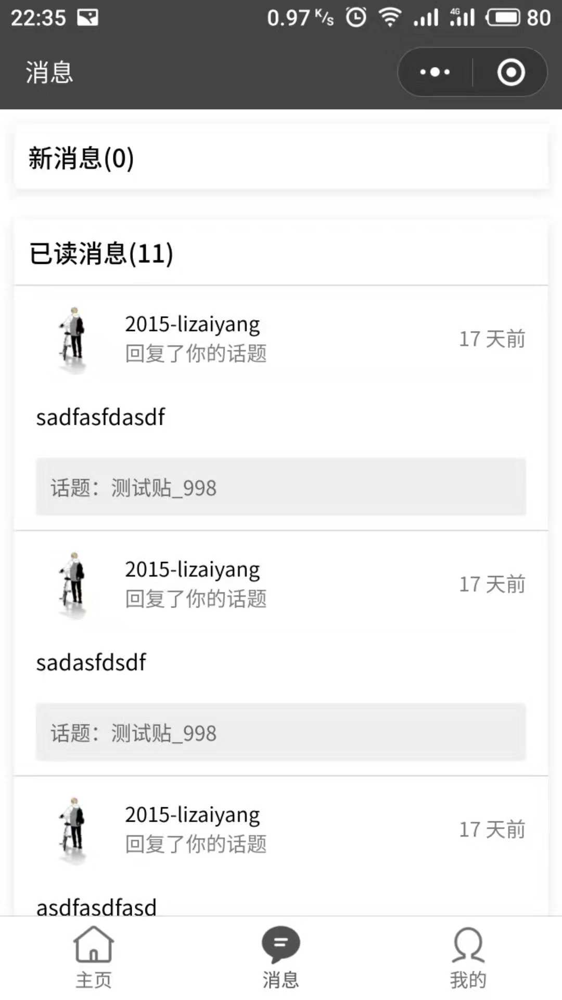
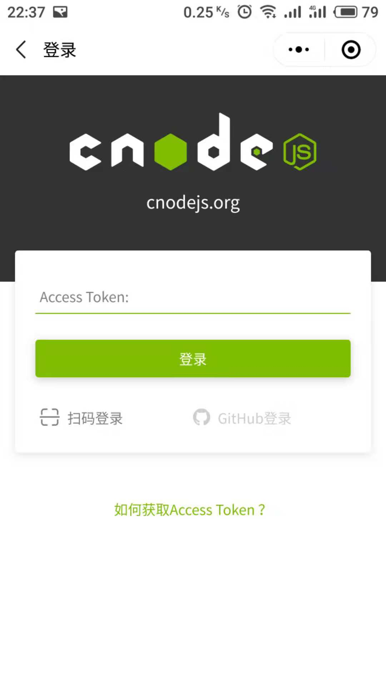

# cnode-wechat-applet

CNode 社区第三方微信小程序版本，欢迎扫码体验👏


## 预览




## 命名规范

项目中变量命名，采用数据类型显式声明的方式

1. fn => function
2. b => boolean
3. s => string
4. n => number
5. a => array
6. o => object

```javascript
// 示例

let fnFoo = function() {};
let bFlag = false;
let sMessage = 'hello world';
let nCount = 0;
let aTodoList = [];
let oTodo = {
  text: '',
  start_time: 1536627800131
};
```

## 项目依赖

* ### [moment](https://github.com/moment/moment)
* ### [path-to-regexp](https://github.com/pillarjs/path-to-regexp)
* ### [wemark](https://github.com/TooBug/wemark)

[1]: https://developers.weixin.qq.com/miniprogram/dev/devtools/npm.html
[2]: http://momentjs.cn/docs/#/i18n/