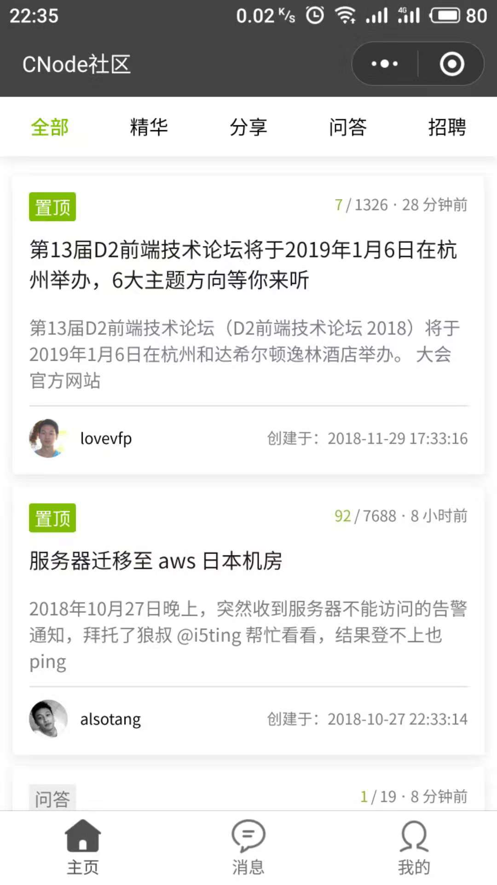
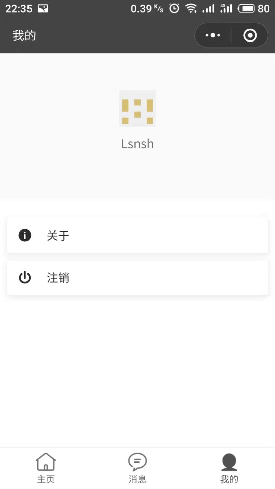

# cnode-wechat-applet

CNode 社区第三方微信小程序版本


## 预览




## 命名规范

项目中变量命名，采用数据类型显式声明的方式

1. fn => function
2. b => boolean
3. s => string
4. n => number
5. a => array
6. o => object

```javascript
// 示例

let fnFoo = function() {};
let bFlag = false;
let sMessage = 'hello world';
let nCount = 0;
let aTodoList = [];
let oTodo = {
  text: '',
  start_time: 1536627800131
};
```

> 不确定数据类型的变量，没有强制遵循